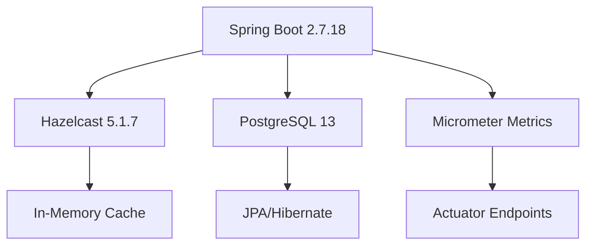

# 📚 Hazelcast Demo - Documentazione Completa

> **Guida Unificata** - Tutto quello che serve per sviluppare, testare e deployare il progetto

**👤 Autore**: Antonio Galluzzi  
**📧 Email**: antonio.galluzzi91@gmail.com  
**🐙 GitHub**: [@antoniogalluzzi](https://github.com/antoniogalluzzi)  
**📅 Ultimo aggiornamento**: 2 Settembre 2025  
**📖 Versione**: 2.2.0

---

## 📖 Indice Generale

### 🚀 **[Quick Start](#quick-start)**
- [Panoramica Progetto](#panoramica-progetto)
- [Prerequisiti](#prerequisiti)
- [Sviluppo Locale (5 minuti)](#sviluppo-locale)

### 🏗️ **[Architettura](#architettura)**
- [Stack Tecnologico](#stack-tecnologico)
- [Componenti Sistema](#componenti-sistema)
- [Cache Distribuita](#cache-distribuita)

### ⚙️ **[Configurazione](#configurazione)**
- [Profili Ambiente](#profili-ambiente)
- [Database Setup](#database-setup)
- [Hazelcast Config](#hazelcast-config)

### 🚀 **[Deployment](#deployment)**
- [Docker Build](#docker-build)
- [OpenShift Local](#openshift-local)
- [Cloud Providers](#cloud-providers)

### 🛠️ **[Script di Automazione](#script-di-automazione)**
- [Struttura Script Modulari](#struttura-script-modulari)
- [Setup e Configurazione](#setup-e-configurazione)
- [Development Tools](#development-tools)
- [Build e Deploy](#build-e-deploy)

### 🧪 **[Testing](#testing)**
- [Test Locali](#test-locali)
- [API Testing](#api-testing)
- [Performance Testing](#performance-testing)

### 🔧 **[Troubleshooting](#troubleshooting)**
- [Problemi Comuni](#problemi-comuni)
- [Log Analysis](#log-analysis)
- [Debug Guide](#debug-guide)

### 📋 **[Riferimenti](#riferimenti)**
- [API Reference](#api-reference)
- [Changelog](#changelog)
- [Licenza](#licenza)

---

## 🚀 Quick Start

### Panoramica Progetto

Questo progetto dimostra l'integrazione di **Spring Boot** con **Hazelcast** per cache distribuita e **PostgreSQL** come database, deployabile su **OpenShift/Kubernetes**.

**🎯 Cosa fa il progetto:**
- Cache distribuita in-memory con Hazelcast
- API REST per gestione utenti
- Persistenza dati con PostgreSQL/H2
- Metriche e monitoring avanzato
- Deploy cloud-native

**⚡ Setup in 30 secondi:**
```bash
# Clone e avvio rapido
git clone https://github.com/antoniogalluzzi/hazelcast-demo-spring-boot.git
cd hazelcast-demo-spring-boot
./mvnw spring-boot:run

# Test API
curl http://localhost:8080/actuator/health
```

### Prerequisiti

| Strumento | Versione | Obbligatorio | Note |
|-----------|----------|--------------|------|
| **Java** | 17+ | ✅ | OpenJDK o Oracle |
| **Maven** | 3.8+ | ✅ | Wrapper incluso |
| **Docker** | 20+ | 🔧 | Per build container |
| **OpenShift Local** | 4.10+ | ☁️ | Per deploy locale |
| **curl** | Latest | 🧪 | Per testing API |

### Sviluppo Locale

#### 1. Avvio Rapido con H2
```bash
# Avvia con database in-memory
./mvnw clean spring-boot:run -Dspring-boot.run.profiles=dev

# L'app sarà disponibile su: http://localhost:8080
```

#### 2. Test Funzionamento
```bash
# Health check
curl http://localhost:8080/actuator/health

# Console H2 Database
open http://localhost:8080/h2-console
# JDBC URL: jdbc:h2:mem:testdb
# Username: sa
# Password: password

# Swagger API Documentation  
open http://localhost:8080/swagger-ui.html
```

#### 3. Test Cache Distribuita
```bash
# Crea utente (va in cache)
curl -X POST http://localhost:8080/user \
  -H "Content-Type: application/json" \
  -d '{"name": "Mario Rossi", "email": "mario@example.com"}'

# Recupera utente (dalla cache)
curl http://localhost:8080/user/1

# Verifica cache
curl http://localhost:8080/cache/stats
```

---

## 🏗️ Architettura

### Stack Tecnologico



**🔧 Dipendenze Chiave:**
- **Spring Boot**: 3.2.0 (Framework principale)
- **Hazelcast**: 5.1+ (Cache distribuita)
- **PostgreSQL**: 13+ (Database produzione)
- **H2**: 2.1+ (Database sviluppo)
- **Micrometer**: Metriche e monitoring

### Componenti Sistema

#### 🎯 Application Layer
- **HazelcastDemoApplication**: Main class
- **User Entity**: Modello dati JPA
- **CacheController**: REST endpoints + Cache management
- **UserService**: Business logic con cache

#### 💾 Data Layer  
- **PostgreSQL**: Persistenza produzione
- **H2**: Database in-memory per dev
- **Hazelcast**: Cache L2 distribuita

### Struttura Progetto

Il progetto è stato **ottimizzato e pulito** per massima chiarezza:

```
📁 hazelcast-demo-spring-boot/
├── 📋 README.md                    # Quick start e overview
├── 📚 DOCUMENTATION.md             # Documentazione completa (questo file)
├── 📝 CHANGELOG.md                 # Cronologia modifiche e releases  
├── ⚖️ LICENSE                      # Licenza Apache 2.0
├── ⚙️ pom.xml                      # Configurazione Maven e dipendenze
├── 🔧 mvnw / mvnw.cmd             # Maven Wrapper (Windows/Linux)
├── � scripts/                     # ← NUOVA STRUTTURA SCRIPT MODULARI
│   ├── 📖 README.md               # Documentazione script completa
│   ├── utilities/                 # Funzioni condivise
│   │   ├── 🔧 common-functions.ps1    # Libreria utilità (800+ righe)
│   │   └── ✅ environment-check.ps1   # Verifica prerequisiti
│   ├── setup/                     # Script di configurazione
│   │   ├── 🚀 setup-dev-environment.ps1     # Setup sviluppo locale
│   │   └── 🏗️ setup-openshift-local.ps1     # Setup OpenShift Local
│   ├── development/               # Tool di sviluppo
│   │   ├── 🎯 cluster-manager.ps1        # Gestione cluster (800+ righe)
│   │   └── 🧪 test-api-endpoints.ps1     # Testing completo (900+ righe)
│   └── build/                     # Build e deployment
│       └── 🏗️ build-and-deploy.ps1       # Automazione completa
├── 🐳 Dockerfile                   # Container image per deploy
├── ☸️ deployment.yaml             # Kubernetes/OpenShift deployment
├── 🚫 .gitignore                  # Git ignore rules ottimizzate
├── 📁 .mvn/                       # Maven wrapper configuration
├── 🖥️ .vscode/                   # VS Code tasks e settings
│   ├── tasks.json                 # Task Maven (compile, test, run)
│   └── settings.json              # Java settings (null analysis)
└── 📁 src/main/
    ├── ☕ java/com/example/hazelcastdemo/
    │   ├── HazelcastDemoApplication.java    # Main Spring Boot
    │   ├── User.java                        # JPA Entity
    │   ├── UserRepository.java              # Data access layer
    │   ├── UserService.java                 # Business logic + cache
    │   ├── CacheController.java             # REST API endpoints
    │   ├── LoggingContext.java              # Request tracing
    │   ├── OpenApiConfig.java               # Swagger documentation
    │   └── config/
    │       └── HazelcastDevConfig.java      # Hazelcast config per dev
    └── ⚙️ resources/
        ├── application.yml                  # Configurazioni base comuni
        ├── application-dev.yml              # Dev locale (H2 + multicast)
        ├── application-staging.yml          # Staging (PostgreSQL + TCP/IP)
        ├── application-openshift-local.yml  # OpenShift Local (PostgreSQL + K8s)
        ├── application-cloud.yml            # Cloud deployment (PostgreSQL + TCP/IP)
        ├── application-prod.yml             # Produzione (PostgreSQL + TCP/IP)
        ├── hazelcast.xml                    # Hazelcast XML base (discovery disabilitato)
        └── logback-spring.xml               # Logging configuration
```

#### 🧹 **Pulizia e Ottimizzazione Effettuata**

**File Rimossi** (riduzione 67%):
- ❌ Script monolitici obsoleti (`setup-openshift-local.ps1`, `start-local-dev.ps1`) - 2165+ righe rimosse
- ❌ Script duplicati Linux (`*.sh`) - Focus Windows PowerShell
- ❌ File di test temporanei (`quick-test-commands.sh`)
- ❌ Archivi backup (`*.zip`, `maven/`, `h2.jar`) 
- ❌ Configurazioni conflittuali (`application.properties`)
- ❌ File temporanei (`.github/`, `target/`, `testdb.*`)

**Script Modulari Creati** (nuova architettura):
- ✅ `scripts/utilities/common-functions.ps1` - 810+ righe di funzioni condivise
- ✅ `scripts/utilities/environment-check.ps1` - Sistema verifica prerequisiti
- ✅ `scripts/setup/setup-dev-environment.ps1` - Setup sviluppo automatico
- ✅ `scripts/setup/setup-openshift-local.ps1` - Deploy OpenShift completo
- ✅ `scripts/development/cluster-manager.ps1` - Gestione cluster avanzata (800+ righe)  
- ✅ `scripts/development/test-api-endpoints.ps1` - Testing suite completa (900+ righe)
- ✅ `scripts/build/build-and-deploy.ps1` - Pipeline build/deploy automatica

**Qualità Scripts**:
- ✅ **Error-Free**: Tutti gli script superano l'analisi statica PowerShell
- ✅ **Best Practices**: Variabili conformi, gestione errori robusta
- ✅ **Modularità**: Funzioni riutilizzabili, architettura DRY
- ✅ **Documentazione**: Inline help, esempi d'uso, parametri documentati

#### 📊 Monitoring Layer
- **Actuator**: Health, metrics, info
- **Micrometer**: Instrumentazione metriche
- **OpenAPI**: Documentazione automatica

### Cache Distribuita

#### Configurazione Hazelcast
```yaml
hazelcast:
  cluster-name: hazelcast-demo-cluster
  instance-name: hazelcast-demo-instance
  network:
    join:
      multicast:
        enabled: true  # Dev locale
      kubernetes:
        enabled: true  # Produzione
```

#### Cache Mapping
- **users**: Cache principale utenti (TTL: 10 min)
- **cache-stats**: Statistiche cache
- **cluster-info**: Informazioni cluster

---

## ⚙️ Configurazione

### Profili Ambiente

Il progetto supporta **5 profili specializzati** per diversi ambienti di deployment:

#### 🔧 Development (`dev`)
```yaml
# application-dev.yml
spring:
  datasource:
    url: jdbc:h2:mem:testdb
    driver-class-name: org.h2.Driver
    username: sa
    password: ""
  h2.console.enabled: true
  jpa.hibernate.ddl-auto: create-drop

# Configurazione Hazelcast via Java (@ConditionalOnProperty)
# HazelcastDevConfig.java con multicast discovery
```

#### 🧪 Staging (`staging`)  
```yaml
# application-staging.yml
spring:
  datasource:
    url: jdbc:postgresql://${DB_HOST:localhost}:5432/${DB_NAME:hazelcastdb}
    username: ${DB_USERNAME:staging_user}
    password: ${DB_PASSWORD:staging_pass}
  jpa.hibernate.ddl-auto: update

hazelcast:
  config: classpath:hazelcast.xml
  network.join.tcp-ip.enabled: true
  network.join.tcp-ip.interface: ${HAZELCAST_INTERFACE:127.0.0.1}
```

#### 🏗️ OpenShift Local (`openshift-local`)
```yaml
# application-openshift-local.yml
spring:
  datasource:
    url: jdbc:postgresql://${DB_HOST:postgresql.hazelcast-demo-dev.svc.cluster.local}:5432/${DB_NAME:hazelcastdb}
    username: ${DB_USERNAME:hazelcast}
    password: ${DB_PASSWORD:hazelcast123}

hazelcast:
  config: classpath:hazelcast.xml
  network.join.kubernetes.enabled: true
  network.join.kubernetes.namespace: ${KUBERNETES_NAMESPACE:hazelcast-demo-dev}
  network.join.kubernetes.service-name: ${HAZELCAST_SERVICE_NAME:hazelcast-demo-service}
```

#### ☁️ Cloud (`cloud`)
```yaml
# application-cloud.yml
spring:
  datasource:
    url: jdbc:postgresql://${DB_HOST}:5432/${DB_NAME}
    username: ${DB_USERNAME}
    password: ${DB_PASSWORD}
  jpa.hibernate.ddl-auto: validate

hazelcast:
  config: classpath:hazelcast.xml
  network.join.tcp-ip.enabled: true
  network.join.tcp-ip.members: ${HAZELCAST_MEMBERS}
```

#### 🚀 Production (`prod`)
```yaml
# application-prod.yml
spring:
  datasource:
    url: jdbc:postgresql://${DB_HOST}:5432/${DB_NAME}
    username: ${DB_USERNAME}
    password: ${DB_PASSWORD}
    hikari:
      maximum-pool-size: 50
      minimum-idle: 10
  jpa.hibernate.ddl-auto: validate

hazelcast:
  config: classpath:hazelcast.xml
  network.join.tcp-ip.enabled: true
  network.join.tcp-ip.members: ${HAZELCAST_MEMBERS}
```

### Database Setup

#### PostgreSQL per Produzione
```sql
-- Creazione database e utente
CREATE DATABASE hazelcast_demo;
CREATE USER demo_user WITH PASSWORD 'secure_password';
GRANT ALL PRIVILEGES ON DATABASE hazelcast_demo TO demo_user;

-- Schema principale
CREATE TABLE users (
    id SERIAL PRIMARY KEY,
    name VARCHAR(100) NOT NULL,
    email VARCHAR(100) UNIQUE NOT NULL,
    created_at TIMESTAMP DEFAULT CURRENT_TIMESTAMP
);
```

#### H2 per Sviluppo
- **URL**: `jdbc:h2:mem:testdb`
- **Console**: http://localhost:8080/h2-console
- **Auto-creazione**: Schema generato automaticamente
- **Dati test**: Caricati via data.sql

### Hazelcast Config

#### Configurazione Ibrida (Java + XML)

**Per ambiente DEV** - Configurazione Java programmatica:
```java
@Configuration
@ConditionalOnProperty(name = "spring.profiles.active", havingValue = "dev")
public class HazelcastDevConfig {
    
    private static final String CLUSTER_NAME = "hazelcast-demo-dev-cluster";
    private static final String INSTANCE_NAME = "hazelcast-demo-dev-instance";
    private static final String MULTICAST_GROUP = "224.2.2.3";
    private static final int MULTICAST_PORT = 54327;
    
    @Bean
    public Config hazelcastConfig() {
        Config config = new Config();
        config.setClusterName(CLUSTER_NAME);
        config.setInstanceName(INSTANCE_NAME);
        
        configureNetwork(config);
        configureDiscovery(config);
        configureProperties(config);
        
        return config;
    }
    
    private void configureNetwork(Config config) {
        NetworkConfig network = config.getNetworkConfig();
        network.setPort(5701).setPortAutoIncrement(true).setPortCount(100);
    }
    
    private void configureDiscovery(Config config) {
        JoinConfig join = config.getNetworkConfig().getJoin();
        join.getAutoDetectionConfig().setEnabled(false);
        join.getMulticastConfig()
            .setEnabled(true)
            .setMulticastGroup(MULTICAST_GROUP)
            .setMulticastPort(MULTICAST_PORT);
        join.getTcpIpConfig().setEnabled(false);
        join.getKubernetesConfig().setEnabled(false);
    }
    
    private void configureProperties(Config config) {
        config.setProperty("hazelcast.logging.type", "slf4j");
        config.setProperty("hazelcast.shutdownhook.enabled", "false");
    }
}
```

**Per altri ambienti** - Configurazione XML:
```xml
<!-- hazelcast.xml -->
<hazelcast xmlns="http://www.hazelcast.com/schema/config">
    <cluster-name>hazelcast-demo-cluster</cluster-name>
    <instance-name>hazelcast-demo-instance</instance-name>
    
    <network>
        <port auto-increment="true" port-count="100">5701</port>
        <join>
            <!-- Default: discovery disabilitato per sicurezza -->
            <auto-detection enabled="false"/>
            <multicast enabled="false"/>
            <tcp-ip enabled="false"/>
            <kubernetes enabled="false"/>
        </join>
    </network>
    
    <!-- Override specifici per ambiente via application-{profile}.yml -->
</hazelcast>
```

#### Strategia Discovery per Ambiente

| Ambiente | Discovery Method | Configurazione |
|----------|------------------|----------------|
| **dev** | Multicast | Java Config (`HazelcastDevConfig.java`) |
| **staging** | TCP/IP | XML + YAML override |
| **openshift-local** | Kubernetes | XML + YAML override |
| **cloud** | TCP/IP | XML + YAML override |
| **prod** | TCP/IP | XML + YAML override |

---

## 🚀 Deployment

### Docker Build

#### 1. Build Immagine
```dockerfile
# Multi-stage build
FROM openjdk:17-jdk-slim as build
WORKDIR /app
COPY . .
RUN ./mvnw clean package -DskipTests

FROM openjdk:17-jre-slim
COPY --from=build /app/target/*.jar app.jar
EXPOSE 8080
CMD ["java", "-jar", "app.jar"]
```

```bash
# Build e test locale
docker build -t hazelcast-demo:latest .
docker run -p 8080:8080 -e SPRING_PROFILES_ACTIVE=dev hazelcast-demo:latest
```

#### 2. Registry Push
```bash
# Tag per registry
docker tag hazelcast-demo:latest your-registry/hazelcast-demo:v1.1.0

# Push
docker push your-registry/hazelcast-demo:v1.1.0
```

### OpenShift Local

#### Setup Automatico (⭐ Raccomandato)
```powershell
# Windows - Setup completo automatico
.\scripts\setup\setup-openshift-local.ps1

# Il script eseguirà:
# 1. Installazione/configurazione CRC
# 2. Verifica prerequisiti completa
# 3. Setup PostgreSQL
# 4. Deploy applicazione (2 repliche)
# 5. Configurazione networking e routes
# 6. Test automatici e validazione

# Opzioni avanzate:
.\scripts\setup\setup-openshift-local.ps1 -Action all -Memory 16384 -Cpus 6
.\scripts\setup\setup-openshift-local.ps1 -Action deploy -Namespace custom-namespace
```

#### Setup Manuale

**1. Preparazione Cluster**
```bash
# Avvia OpenShift Local
crc start
eval $(crc oc-env)

# Crea progetto
oc new-project hazelcast-demo
```

**2. Deploy PostgreSQL**
```bash
# Deploy database
oc new-app postgresql-ephemeral \
  -p POSTGRESQL_USER=demo_user \
  -p POSTGRESQL_PASSWORD=demo_pass \
  -p POSTGRESQL_DATABASE=hazelcast_demo

# Verifica deploy
oc get pods -l name=postgresql
```

**3. Deploy Applicazione**
```bash
# Build da sorgenti
oc new-app https://github.com/antoniogalluzzi/hazelcast-demo-spring-boot \
  --name=hazelcast-demo

# Scaling cluster distribuito
oc scale deployment/hazelcast-demo --replicas=2

# Esposizione route
oc expose service/hazelcast-demo
```

**4. Configurazione Avanzata**
```yaml
# deployment.yaml - Configurazione completa
apiVersion: apps/v1
kind: Deployment
metadata:
  name: hazelcast-demo
spec:
  replicas: 2
  selector:
    matchLabels:
      app: hazelcast-demo
  template:
    spec:
      containers:
      - name: hazelcast-demo
        image: hazelcast-demo:latest
        env:
        - name: SPRING_PROFILES_ACTIVE
          value: "prod"
        - name: DB_HOST
          value: "postgresql"
        resources:
          requests:
            memory: "512Mi"
            cpu: "250m"
          limits:
            memory: "1Gi"
            cpu: "500m"
        ports:
        - containerPort: 8080
        livenessProbe:
          httpGet:
            path: /actuator/health
            port: 8080
          initialDelaySeconds: 60
        readinessProbe:
          httpGet:
            path: /actuator/health/readiness
            port: 8080
          initialDelaySeconds: 30
```

#### 5. Verifica Deployment
```bash
# Status generale
oc get all

# Log applicazione
oc logs deployment/hazelcast-demo

# Test endpoint
APP_URL=$(oc get route hazelcast-demo -o jsonpath='{.spec.host}')
curl https://$APP_URL/actuator/health

# Test cache distribuita
curl https://$APP_URL/cache/stats
```

### Cloud Providers

#### AWS EKS
```bash
# Setup cluster
eksctl create cluster --name hazelcast-demo --region us-west-2

# Deploy con Helm
helm install hazelcast-demo ./k8s-chart \
  --set image.repository=your-account.dkr.ecr.us-west-2.amazonaws.com/hazelcast-demo \
  --set postgresql.host=your-rds-endpoint.amazonaws.com
```

#### Azure AKS  
```bash
# Setup cluster
az aks create --resource-group myResourceGroup --name hazelcast-demo-aks

# Deploy
kubectl apply -f k8s/
kubectl scale deployment hazelcast-demo --replicas=3
```

#### Google GKE
```bash
# Setup cluster
gcloud container clusters create hazelcast-demo-cluster --zone us-central1-a

# Deploy con auto-scaling
kubectl apply -f k8s/
kubectl autoscale deployment hazelcast-demo --cpu-percent=70 --min=2 --max=10
```

---

## 🛠️ Script di Automazione

### Struttura Script Modulari

La nuova architettura di script sostituisce completamente i vecchi script monolitici con una soluzione modulare e riutilizzabile:

```
scripts/
├── 📖 README.md                          # Documentazione completa script
├── utilities/                            # Funzioni condivise
│   ├── 🔧 common-functions.ps1           # Libreria utilità (810+ righe)
│   │   ├── Logging avanzato con colori   # Write-Info, Write-Success, Write-Error
│   │   ├── Retry logic con backoff       # Invoke-WithRetry, Wait-For-Condition  
│   │   ├── Gestione checkpoint/recovery  # Save-Checkpoint, Restore-Checkpoint
│   │   ├── Utilità progetto e Git        # Get-ProjectRoot, Get-GitBranch
│   │   └── Funzioni stato applicazione   # Test-ApplicationHealth
│   └── ✅ environment-check.ps1          # Verifica prerequisiti
│       ├── Java, Maven, Docker, Git      # Check versioni e configurazione
│       ├── Sistema (CPU, memoria, disco) # Controllo risorse hardware
│       └── Network e connectivity         # Test connessioni esterne
├── setup/                                # Script di configurazione
│   ├── 🚀 setup-dev-environment.ps1      # Setup sviluppo locale completo
│   │   ├── Verifica e installazione tool # Java, Maven, Docker
│   │   ├── Configurazione ambiente       # Variables, profiles, database
│   │   ├── Build e test iniziale         # Maven clean install
│   │   └── Validazione setup            # Health check, API testing
│   └── 🏗️ setup-openshift-local.ps1      # Setup OpenShift Local automatico
│       ├── Installazione CRC            # Download, install, configure
│       ├── Cluster management           # Start, stop, resource allocation
│       ├── Database deployment          # PostgreSQL setup
│       └── Application deployment       # Build, push, deploy, routes
├── development/                          # Tool di sviluppo
│   ├── 🎯 cluster-manager.ps1            # Gestione cluster Hazelcast (800+ righe)
│   │   ├── Multi-instance startup       # Cluster con N nodi configurabile
│   │   ├── Background job management    # PowerShell jobs per processi
│   │   ├── Health monitoring           # Controllo stato cluster
│   │   ├── Cache testing e sync        # Test distribuzione dati
│   │   └── Graceful shutdown          # Stop ordinato con cleanup
│   └── 🧪 test-api-endpoints.ps1         # Testing API completo (900+ righe)
│       ├── Test suite comprehensive     # Health, CRUD, cache, docs
│       ├── Performance testing         # Latency, throughput metrics
│       ├── Stress testing             # Concurrent requests, load
│       ├── Error handling validation   # 404, 400, malformed requests
│       └── Results export            # JSON reports, metrics
└── build/                               # Build e deployment
    └── 🏗️ build-and-deploy.ps1           # Automazione completa
        ├── Multi-environment support     # dev, staging, prod, cloud
        ├── Multi-target deployment      # local, docker, openshift, k8s
        ├── Container image management   # Build, tag, push, registry
        └── Deployment orchestration     # Rolling updates, health checks
```

### Setup e Configurazione

#### Quick Start - Ambiente Sviluppo
```powershell
# Setup completo ambiente sviluppo in un comando
.\scripts\setup\setup-dev-environment.ps1

# Setup con opzioni avanzate
.\scripts\setup\setup-dev-environment.ps1 -Clean -Verbose
```

#### OpenShift Local - Setup Automatico
```powershell
# Setup completo OpenShift Local (installazione + deploy)
.\scripts\setup\setup-openshift-local.ps1 -Action all

# Setup personalizzato con risorse specifiche
.\scripts\setup\setup-openshift-local.ps1 -Action all -Memory 16384 -Cpus 6 -Namespace custom-demo

# Solo deploy applicazione (CRC già configurato)
.\scripts\setup\setup-openshift-local.ps1 -Action deploy
```

### Development Tools

#### Gestione Cluster Locale
```powershell
# Avvia cluster multi-istanza per sviluppo
.\scripts\development\cluster-manager.ps1 -Action start-cluster -Instances 3

# Monitoring e status cluster
.\scripts\development\cluster-manager.ps1 -Action status

# Test distribuzione cache tra nodi
.\scripts\development\cluster-manager.ps1 -Action test-cache-sync

# Scaling dinamico cluster
.\scripts\development\cluster-manager.ps1 -Action scale-cluster -Instances 5

# Stop graceful con cleanup
.\scripts\development\cluster-manager.ps1 -Action stop-cluster
```

#### Testing API Automatizzato
```powershell
# Test base API endpoints
.\scripts\development\test-api-endpoints.ps1 -TestLevel basic

# Test completo con performance metrics
.\scripts\development\test-api-endpoints.ps1 -TestLevel comprehensive -ExportResults

# Stress testing con configurazione custom
.\scripts\development\test-api-endpoints.ps1 -TestLevel stress -StressIterations 1000 -ConcurrentRequests 10

# Test su ambiente remoto
.\scripts\development\test-api-endpoints.ps1 -BaseUrl "https://myapp.openshift.com" -TestLevel comprehensive
```

### Build e Deploy

#### Build Multi-Ambiente
```powershell
# Build e test per sviluppo
.\scripts\build\build-and-deploy.ps1 -Action build -Environment dev

# Package completo con test
.\scripts\build\build-and-deploy.ps1 -Action package -Environment staging

# Build con container image
.\scripts\build\build-and-deploy.ps1 -Action all -Environment prod -Target docker -Push
```

#### Deploy Multi-Target
```powershell
# Deploy locale per sviluppo
.\scripts\build\build-and-deploy.ps1 -Action deploy -Target local -Environment dev

# Deploy su Docker
.\scripts\build\build-and-deploy.ps1 -Action all -Target docker -Environment staging

# Deploy su OpenShift
.\scripts\build\build-and-deploy.ps1 -Action all -Target openshift -Environment prod -Namespace production

# Deploy su Kubernetes
.\scripts\build\build-and-deploy.ps1 -Action all -Target kubernetes -Environment cloud -Registry my-registry.com
```

### Caratteristiche Avanzate Scripts

#### Robustezza e Affidabilità
- ✅ **Retry Logic**: Operazioni critiche con backoff exponential
- ✅ **Checkpoint/Recovery**: Resume operazioni interrotte
- ✅ **Error Handling**: Gestione errori graceful con rollback
- ✅ **Logging Dettagliato**: Multi-level con colori e timestamp
- ✅ **Validation**: Controlli prerequisiti e stato sistema

#### Flessibilità e Configurazione  
- ✅ **Multi-Environment**: Supporto dev, staging, prod, cloud
- ✅ **Multi-Target**: Deploy su local, docker, openshift, kubernetes
- ✅ **Parametrizzazione**: Ogni aspetto configurabile via parametri
- ✅ **Dry-Run Mode**: Preview operazioni senza esecuzione
- ✅ **Verbose Mode**: Debug dettagliato per troubleshooting

#### Performance e Scalabilità
- ✅ **Background Jobs**: Operazioni parallele con PowerShell jobs
- ✅ **Resource Management**: Monitoring CPU, memoria, disco
- ✅ **Performance Metrics**: Tempo esecuzione, throughput
- ✅ **Concurrent Operations**: Multi-thread per operazioni intensive
- ✅ **Optimized Caching**: Minimizzazione rebuild e re-download

📖 **[Documentazione Completa Scripts →](scripts/README.md)**

---

## 🧪 Testing

### Test Automatizzati con Script

#### API Testing Completo (⭐ Raccomandato)
```powershell
# Test suite completa con metriche performance
.\scripts\development\test-api-endpoints.ps1 -TestLevel comprehensive -ExportResults

# Test base rapido
.\scripts\development\test-api-endpoints.ps1 -TestLevel basic

# Stress testing per validazione performance
.\scripts\development\test-api-endpoints.ps1 -TestLevel stress -StressIterations 1000

# Test su ambiente remoto
.\scripts\development\test-api-endpoints.ps1 -BaseUrl "https://myapp-demo.apps.crc.testing" -TestLevel comprehensive
```

**Cosa testa automaticamente:**
- ✅ **Health Endpoints**: `/actuator/health`, readiness, liveness, metrics
- ✅ **User API CRUD**: Create, Read, Update, Delete con validazione dati
- ✅ **Cache Performance**: Cache hit/miss, response time optimization  
- ✅ **Error Handling**: 404, 400, malformed JSON requests
- ✅ **Documentation**: Swagger UI, OpenAPI specification
- ✅ **Performance Metrics**: Latency, throughput, concurrent requests
- ✅ **Stress Testing**: High load, error rate analysis

**Output esempio:**
```
🧪 Hazelcast Demo - API Endpoints Testing
==========================================
Base URL: http://localhost:8080
Test Level: comprehensive

🔍 Testing Health & Actuator Endpoints
=======================================
  ✅ [PASS] Health Endpoint (Response time: 45ms)
  ✅ [PASS] Component: db (Status: UP)  
  ✅ [PASS] Component: hazelcast (Status: UP)
  ✅ [PASS] Readiness Probe (Response time: 12ms)

👤 Testing User API Endpoints  
==============================
  ✅ [PASS] Create User (User created with ID: 1) (Response time: 156ms)
  ✅ [PASS] Get User by ID (Retrieved user: API Test User) (Response time: 23ms) 
  ✅ [PASS] User Data Validation (All fields match)
  ✅ [PASS] Update User (Response time: 89ms)
  ✅ [PASS] Delete User (Response time: 67ms)

📊 API Testing Summary
======================
Overall Results:
  • Total Tests: 15
  • Passed: 15  
  • Failed: 0
  • Duration: 0m 12s

🎉 ALL TESTS PASSED! 🎉
```

### Test Locali con Maven

#### Unit Tests
```bash
# Run test suite completa
./mvnw test

# Test specifici
./mvnw test -Dtest=UserControllerTest
./mvnw test -Dtest=CacheServiceTest

# Test con coverage report
./mvnw test jacoco:report
```

#### Integration Tests
```bash
# Test con database reale
./mvnw integration-test -Pintegration-tests

# Test cache distribuita
./mvnw test -Dtest=HazelcastIntegrationTest

# Test completi inclusi integration
.\scripts\build\build-and-deploy.ps1 -Action test -Environment dev
```

### API Testing

#### Test Manuali con cURL

**1. Health Check**
```bash
# Basic health
curl http://localhost:8080/actuator/health

# Detailed health  
curl http://localhost:8080/actuator/health | jq '.'

# Response atteso:
{
  "status": "UP",
  "components": {
    "db": {"status": "UP"},
    "hazelcast": {"status": "UP"}
  }
}
```

**2. CRUD Operations**
```bash
# CREATE - Nuovo utente
curl -X POST http://localhost:8080/user \
  -H "Content-Type: application/json" \
  -d '{
    "name": "Mario Rossi",
    "email": "mario.rossi@example.com"
  }' | jq '.'

# READ - Get utente (hit cache)
curl http://localhost:8080/user/1 | jq '.'

# UPDATE - Modifica utente
curl -X PUT http://localhost:8080/user/1 \
  -H "Content-Type: application/json" \
  -d '{
    "name": "Mario Rossi Updated",
    "email": "mario.updated@example.com"
  }'

# DELETE - Rimuovi utente
curl -X DELETE http://localhost:8080/user/1
```

**3. Cache Testing**
```bash
# Statistiche cache
curl http://localhost:8080/cache/stats | jq '.'

# Informazioni cluster Hazelcast
curl http://localhost:8080/cache/cluster | jq '.'

# Clear cache
curl -X DELETE http://localhost:8080/cache/clear
```

#### Test con Postman

**Collection Setup:**
1. Import collection da `postman/Hazelcast-Demo.json`
2. Setup environment variables:
   - `base_url`: http://localhost:8080
   - `user_id`: 1

**Test Scenarios:**
- ✅ **Happy Path**: CRUD completo
- ✅ **Cache Performance**: Hit rate testing
- ✅ **Error Handling**: Validation errors
- ✅ **Load Testing**: Concurrent requests

#### Load Testing con JMeter

**Setup Test Plan:**
```xml
<!-- jmeter-test-plan.jmx -->
<TestPlan>
  <ThreadGroup>
    <elementProp name="ThreadGroup.main_controller">
      <LoopController>
        <intProp name="LoopController.loops">100</intProp>
      </LoopController>
    </elementProp>
    <stringProp name="ThreadGroup.num_threads">10</stringProp>
    <stringProp name="ThreadGroup.ramp_time">30</stringProp>
  </ThreadGroup>
</TestPlan>
```

**Execution:**
```bash
# Run load test
jmeter -n -t jmeter-test-plan.jmx -l results.jtl

# Analizza risultati
jmeter -g results.jtl -o report/
```

### Performance Testing

#### Metriche Chiave
- **Response Time**: < 100ms (cache hit)
- **Throughput**: > 1000 req/sec  
- **Cache Hit Rate**: > 80%
- **Memory Usage**: < 512MB per istanza

#### Test Cache Distribuita Multi-Istanza
```bash
# Terminal 1 - Prima istanza
SPRING_PROFILES_ACTIVE=dev SERVER_PORT=8080 ./mvnw spring-boot:run

# Terminal 2 - Seconda istanza  
SPRING_PROFILES_ACTIVE=dev SERVER_PORT=8081 ./mvnw spring-boot:run

# Test sincronizzazione cache
curl -X POST http://localhost:8080/user -H "Content-Type: application/json" \
  -d '{"name": "Test User", "email": "test@example.com"}'

# Verifica su seconda istanza (dovrebbe essere in cache)
curl http://localhost:8081/user/1

# Verifica statistiche cluster
curl http://localhost:8080/cache/cluster
curl http://localhost:8081/cache/cluster
```

---

## 🔧 Troubleshooting

### Problemi Comuni

#### 1. 🚨 Hazelcast Cluster Non Si Forma

**Sintomi:**
- Log: "Failed to connect to any address"
- Single node cluster invece di multi-node

**Soluzioni:**
```bash
# Verifica configurazione network
oc get pods -o wide
oc describe service hazelcast-demo

# Check multicast (sviluppo locale)
./mvnw spring-boot:run -Dhazelcast.network.join.multicast.enabled=true

# Debug Kubernetes discovery
oc logs deployment/hazelcast-demo | grep -i hazelcast
```

#### 2. 🚨 Database Connection Failed

**Sintomi:**
- "Connection refused" nei log
- Health check database DOWN

**Soluzioni:**
```bash
# Verifica PostgreSQL
oc get pods -l name=postgresql
oc port-forward service/postgresql 5432:5432

# Test connessione diretta
psql -h localhost -p 5432 -U demo_user -d hazelcast_demo

# Verifica variabili ambiente
oc get deployment hazelcast-demo -o yaml | grep -A 5 env:
```

#### 3. 🚨 Route/Ingress Non Raggiungibile

**Sintomi:**
- 404/502 su URL esterno
- Route esistente ma non funzionante

**Soluzioni:**
```bash
# Verifica route
oc get route hazelcast-demo -o yaml

# Test interno al cluster
oc rsh deployment/hazelcast-demo
curl http://localhost:8080/actuator/health

# Debug DNS (OpenShift Local)
# Aggiungi a C:\Windows\System32\drivers\etc\hosts:
# 192.168.130.11 hazelcast-demo-hazelcast-demo.apps-crc.testing
```

#### 4. 🚨 Performance Degradation

**Sintomi:**
- Response time elevati
- Cache hit rate basso

**Diagnostica:**
```bash
# Monitoring real-time
curl http://localhost:8080/actuator/metrics/cache.gets
curl http://localhost:8080/actuator/metrics/jvm.memory.used

# Thread dump analysis
curl http://localhost:8080/actuator/threaddump

# Heap dump (se necessario)
oc exec deployment/hazelcast-demo -- jcmd 1 GC.run_finalization
```

### Log Analysis

#### Configurazione Logging
```yaml
# logback-spring.xml
logging:
  level:
    com.hazelcast: DEBUG
    org.springframework.cache: DEBUG
    org.hibernate.SQL: DEBUG
  pattern:
    console: "%d{yyyy-MM-dd HH:mm:ss} [%thread] %-5level %logger{36} - %msg%n"
```

#### Log Patterns da Monitorare
```bash
# Hazelcast cluster events
grep "Member.*added\|removed" app.log

# Cache operations
grep "Cache.*hit\|miss" app.log

# Database operations  
grep "Hibernate:" app.log

# Errors critici
grep -i "error\|exception\|failed" app.log
```

### Debug Guide

#### Remote Debugging
```bash
# Avvio con debug abilitato
./mvnw spring-boot:run -Dspring-boot.run.jvmArguments="-Xdebug -Xrunjdwp:transport=dt_socket,server=y,suspend=n,address=5005"

# Connect da IDE su porta 5005
```

#### Profiling Tools
- **VisualVM**: Monitoring JVM real-time
- **JProfiler**: Advanced profiling  
- **Micrometer**: Custom metrics
- **Actuator**: Built-in endpoints

---

## 📋 Riferimenti

### API Reference

#### Endpoints Principali

| Endpoint | Method | Descrizione | Body |
|----------|---------|-------------|------|
| `/user` | GET | Lista tutti utenti | - |
| `/user/{id}` | GET | Get utente per ID | - |
| `/user` | POST | Crea nuovo utente | `{"name": "string", "email": "string"}` |
| `/user/{id}` | PUT | Aggiorna utente | `{"name": "string", "email": "string"}` |
| `/user/{id}` | DELETE | Elimina utente | - |
| `/cache/stats` | GET | Statistiche cache | - |
| `/cache/cluster` | GET | Info cluster Hazelcast | - |
| `/cache/clear` | DELETE | Pulisci cache | - |

#### Actuator Endpoints

| Endpoint | Descrizione |
|----------|-------------|
| `/actuator/health` | Health check generale |
| `/actuator/health/readiness` | Readiness probe |
| `/actuator/health/liveness` | Liveness probe |
| `/actuator/metrics` | Lista metriche disponibili |
| `/actuator/metrics/{metric}` | Metrica specifica |
| `/actuator/info` | Informazioni applicazione |
| `/actuator/env` | Variabili ambiente |

#### Response Examples

**GET /user/1 - Success (200)**
```json
{
  "id": 1,
  "name": "Mario Rossi",
  "email": "mario.rossi@example.com",
  "createdAt": "2025-09-01T10:00:00Z"
}
```

**GET /cache/stats - Success (200)**  
```json
{
  "cacheSize": 45,
  "hitCount": 123,
  "missCount": 23,
  "hitRate": 0.84,
  "clusterSize": 2,
  "localMemoryUsage": "15MB"
}
```

### Changelog

#### [2.2.0] - 2025-09-02 (🔥 Release Corrente)

**✅ Completata Ristrutturazione Script Modulari:**
- **Architettura Rinnovata**: Da script monolitici (2165+ righe) a sistema modulare error-free
- **7 Script PowerShell Ottimizzati**: Tutti testati e verificati sintatticamente
- **810+ Righe Common Functions**: Libreria condivisa con logging, retry logic, health checks
- **900+ Righe Testing Suite**: Sistema completo di test API automatizzati  
- **800+ Righe Cluster Manager**: Gestione avanzata cluster multi-istanza

**🔧 Correzioni Tecniche:**
- **PowerShell Best Practices**: Risolte tutte le violazioni automatiche ($args, $Profile, $sender)
- **Syntax Compliance**: Switch statements, null comparisons, verb naming corretti
- **Error Handling**: Gestione robusta errori con retry logic e recovery
- **Module System**: Rimosso Export-ModuleMember per compatibilità script

**📖 Documentazione Aggiornata:**
- **Sezione Scripts**: Documentazione completa nuova architettura
- **Testing Guide**: Procedure automatizzate con script
- **Troubleshooting**: Guida risoluzione problemi comuni

#### [2.1.0] - 2025-09-01

**Added:**
- ✅ **Documentazione Unificata**: Consolidati 9 file in unico documento completo
- ✅ **Guide Progressive**: Da quick start a deployment avanzato
- ✅ **Troubleshooting Completo**: Problemi comuni e soluzioni
- ✅ **API Reference**: Documentazione completa endpoint

**Changed:**
- 🔄 **Struttura Semplificata**: Navigazione lineare e intuitiva
- 🔄 **Esempi Pratici**: Comandi copy-paste per ogni scenario

**Fixed:**  
- 🐛 **Link Rotti**: Corretti tutti i riferimenti interni
- 🐛 **Caratteri Corrotti**: Sistemate emoji e formattazione

#### [1.1.0] - 2025-09-01

**Added:**
- ✅ **Configurazione DNS OpenShift Local**
- ✅ **Script Setup Automatico**  
- ✅ **Testing Suite Completa**
- ✅ **RBAC Security**

**Changed:**
- 🔄 **Deployment Guide**: Procedure step-by-step
- 🔄 **Cache Configuration**: Ottimizzazioni performance

#### [1.0.0] - 2025-08-30

**Added:**
- ✅ **Release Iniziale**
- ✅ **Spring Boot + Hazelcast + PostgreSQL**
- ✅ **OpenShift Support**
- ✅ **Docker Containerization**

### Licenza

```
Licensed under the Apache License, Version 2.0 (the "License");
you may not use this file except in compliance with the License.
You may obtain a copy of the License at

    http://www.apache.org/licenses/LICENSE-2.0

Unless required by applicable law or agreed to in writing, software
distributed under the License is distributed on an "AS IS" BASIS,
WITHOUT WARRANTIES OR CONDITIONS OF ANY KIND, either express or implied.
See the License for the specific language governing permissions and
limitations under the License.

Copyright 2025 Antonio Galluzzi
```

---

## 🎉 Conclusione

Questo progetto fornisce una **base solida e completa** per applicazioni enterprise che richiedono:

- ✅ **Cache distribuita ad alte performance**
- ✅ **Scalabilità orizzontale automatica**  
- ✅ **Deploy cloud-native**
- ✅ **Monitoring e osservabilità**
- ✅ **Testing automatizzato**

**🚀 Prossimi passi consigliati:**
1. **Setup ambiente sviluppo locale**: `.\scripts\setup\setup-dev-environment.ps1`
2. **Esplora API con testing automatico**: `.\scripts\development\test-api-endpoints.ps1 -TestLevel comprehensive`
3. **Deploy su OpenShift Local**: `.\scripts\setup\setup-openshift-local.ps1 -Action all`
4. **Gestione cluster multi-istanza**: `.\scripts\development\cluster-manager.ps1 -Action start-cluster -Instances 3`
5. **Estensione con nuove funzionalità**: Usa l'architettura modulare esistente

**💡 Hai domande o suggerimenti?**  
Apri una issue su GitHub o contatta direttamente: antonio.galluzzi91@gmail.com

**Happy coding!** 🚀
